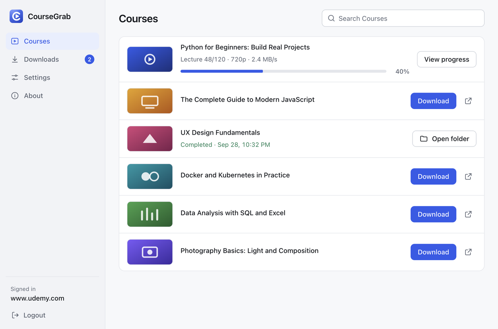
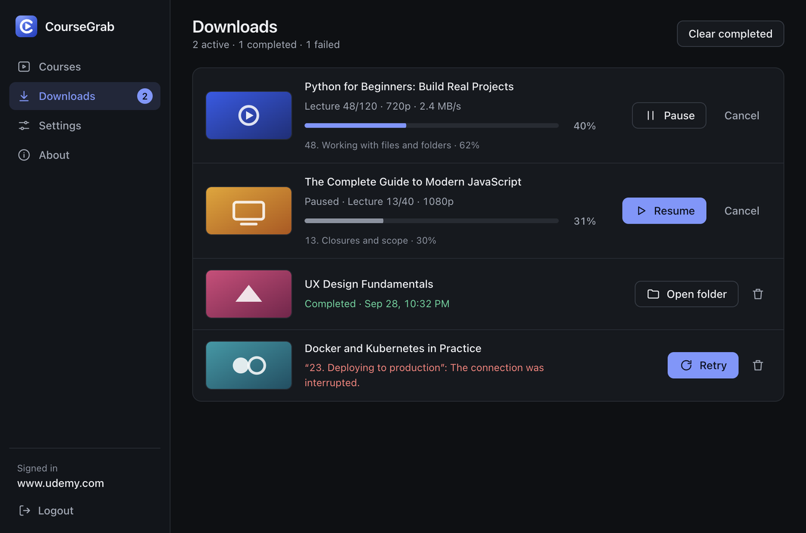
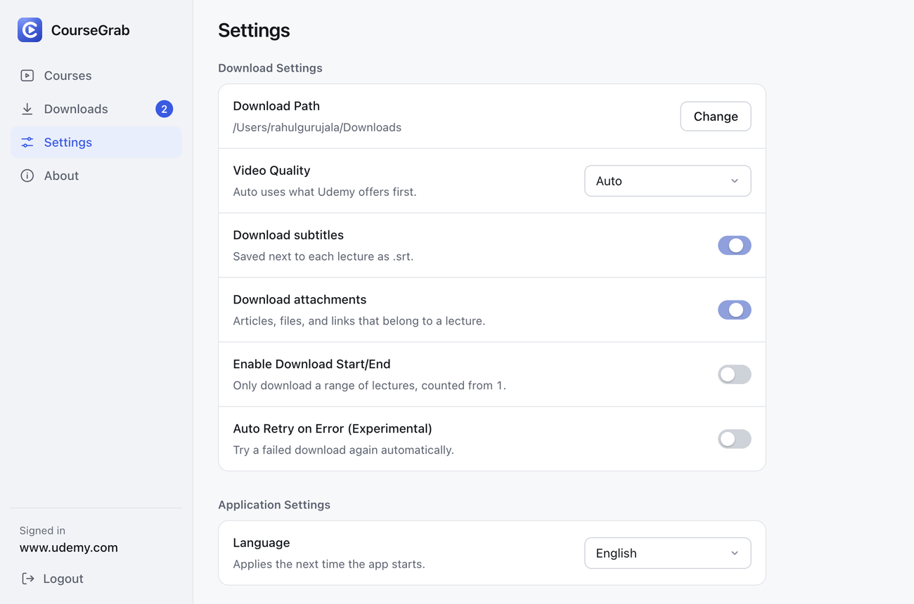
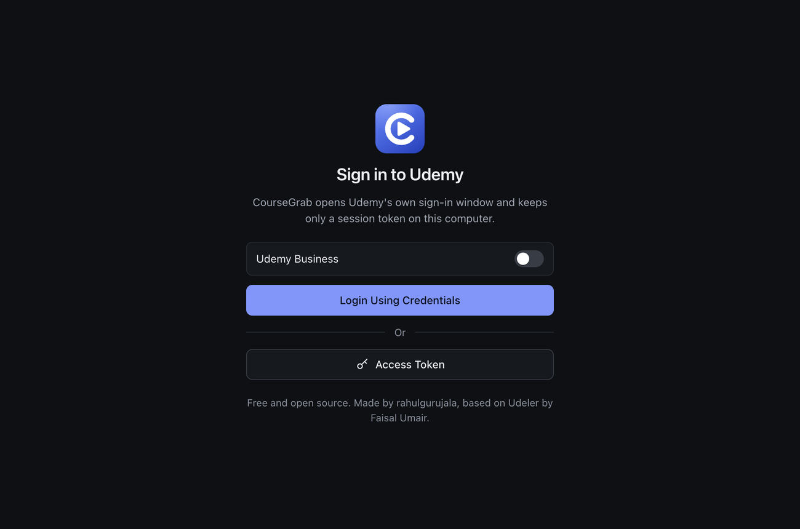

<p align="center">
  
</p>

<h1 align="center">CourseGrab</h1>

<p align="center">
  Save the Udemy courses you are enrolled in and study them offline.<br>
  A free, open source desktop app for Windows, macOS and Linux.
</p>

<p align="center">
  <a href="https://github.com/rahulgurujala/coursegrab/releases/latest"></a>
  <a href="LICENSE"></a>
  
  <a href="https://github.com/rahulgurujala/coursegrab/actions/workflows/release.yml"></a>
</p>

<p align="center">
  <a href="#installation">Installation</a> ·
  <a href="#features">Features</a> ·
  <a href="#usage">Usage</a> ·
  <a href="#settings">Settings</a> ·
  <a href="#troubleshooting">Troubleshooting</a> ·
  <a href="#development">Development</a> ·
  <a href="#contributing">Contributing</a>
</p>

<p align="center">
  
  
</p>

> The screenshots use sample course data.

## Overview

CourseGrab signs in to your Udemy account, lists the courses you are enrolled in, and saves their lectures to a folder on your computer. Each course keeps its chapter structure, so you end up with an organised library of video files, subtitles and attachments that you can open with any player.

It only works with courses you already have access to. Everything runs on your computer and talks directly to Udemy. There is no CourseGrab account, no server and no advertising.

## Features

**Sign in**
- Sign in through Udemy's own login window, or paste an access token.
- Works with Udemy Business accounts.
- Verifies every token before accepting it, and tells you why when Udemy rejects one.

**Find courses**
- Search your courses by keyword, or paste a course link.
- Loads your library in pages, with a loading skeleton and clear empty and error states.

**Download**
- Download several courses at the same time.
- Pause, resume and cancel from the Downloads view. Partly downloaded files continue where they stopped, even after the app was closed or crashed.
- Download a course again later and only what is **new or changed** is fetched. Lectures you already have are left alone, and renamed lectures are moved instead of downloaded again.
- See the current lecture, quality, speed and overall progress for every course.
- Failed downloads state the reason and offer Retry. A dropped connection is retried automatically. Downloads interrupted by closing the app come back with a Resume button.
- A live badge on the Downloads tab shows what is running, even when you are on another screen.
- Click a course in Downloads to see **every lecture**, grouped by chapter, with its state: waiting, downloading with live progress, done with file size, unchanged, skipped (protected or unavailable) or failed with the reason. Filter the list, and press **Check for changes** to compare the course with Udemy without downloading anything.
- Open the finished folder with one click.

**Content**
- Video in the quality you choose (Auto, Highest, 1080p, 720p, 480p, 360p or Lowest).
- Subtitles converted to `.srt`, with a language picker per course.
- Attachments: articles, files and links that belong to a lecture.
- Optional lecture range, for example only lectures 10 to 25.
- Lectures that have no downloadable video (for example ones protected by DRM) are skipped and listed, so one protected lecture never blocks the rest of the course.

**The app**
- Light and dark themes that follow your system.
- A resizable window that adapts to small sizes.
- More than 20 interface languages, including right to left layouts.
- Keyboard shortcuts and screen reader friendly controls.
- Settings save as you change them.

## Screenshots

<p align="center">
  
  
</p>

## Installation

Download the installer for your system from the [latest release](https://github.com/rahulgurujala/coursegrab/releases/latest).

| System | File |
| ------ | ---- |
| macOS, Apple Silicon (M1, M2, M3, M4) | `CourseGrab-<version>-mac-arm64.dmg` |
| macOS, Intel | `CourseGrab-<version>-mac-x64.dmg` |
| Windows 64-bit | `CourseGrab-<version>-win-x64.exe` |
| Linux 64-bit | `CourseGrab-<version>-linux-x86_64.AppImage` |

Only download installers from the Releases page above.

### Why does my system show a warning?

The installers are **not code-signed yet**, because signing certificates cost money and CourseGrab is a free project. Your system therefore warns you the first time you open the app. This does not mean the file is damaged. Follow the steps for your system.

<details>
<summary><strong>macOS</strong></summary>

1. Open the `.dmg` and drag **CourseGrab** into **Applications**.
2. Open CourseGrab from Applications. macOS says it cannot be opened or that it cannot verify the developer. Close that message.
3. Open **System Settings, Privacy & Security** (on macOS 12 or older: **System Preferences, Security & Privacy, General**).
4. In the **Security** section, find the message about CourseGrab and click **Open Anyway**. Enter your password if asked, then click **Open**.

If macOS says the app is **"damaged and can't be opened"** and there is no Open Anyway button, remove the download flag in Terminal and open the app again:

```sh
xattr -dr com.apple.quarantine /Applications/CourseGrab.app
```

You only need to do this once.

</details>

<details>
<summary><strong>Windows</strong></summary>

1. Run the `.exe`. A blue window says **"Windows protected your PC"**.
2. Click **More info**, then **Run anyway**.
3. Finish the installer as usual.

Some antivirus programs flag unsigned installers by mistake. If yours does, allow the file or [build CourseGrab from source](#development).

</details>

<details>
<summary><strong>Linux</strong></summary>

1. Make the AppImage runnable and start it:

   ```sh
   chmod +x CourseGrab-*.AppImage
   ./CourseGrab-*.AppImage
   ```

2. If it fails with a **FUSE** error, install FUSE (`sudo apt install libfuse2`, or `libfuse2t64` on Ubuntu 24.04), or run it without FUSE:

   ```sh
   ./CourseGrab-*.AppImage --appimage-extract-and-run
   ```

3. If it stops with a **sandbox** error on Ubuntu 24.04 or newer, start it with `--no-sandbox`:

   ```sh
   ./CourseGrab-*.AppImage --no-sandbox
   ```

</details>

If you used Udeler before, CourseGrab keeps your existing settings and login.

## Usage

1. **Sign in.** Choose one of the options on the sign in screen:
   - **Login Using Credentials** opens Udemy's sign in window. When you finish, CourseGrab detects it and closes the window.
   - **Access Token** signs you in with a token you paste. While you are signed in to Udemy in your browser, copy the value of the `access_token` cookie (open the browser developer tools, then Application or Storage, Cookies, `udemy.com`).
   - For **Udemy Business**, switch on Udemy Business first and enter your company name (the part before `.udemy.com`).
2. **Find a course.** Scroll the list, search by keyword, or paste a course link into the search box. Press `/` to jump to the search box.
3. **Start the download.** Press **Download** on a course. If the course has subtitles you are asked which language to save.
4. **Follow the progress.** The Downloads view shows every course. Use **Pause**, **Resume** and **Cancel**, and **Retry** if something fails. Click a course (or its details button) to open the full lecture list and see what is being downloaded, what is waiting and what was skipped.
5. **Open your files.** Press **Open folder** on a finished course.
6. **Get updates later.** Press **Get updates** on a finished course, or press Download on it again. CourseGrab compares the course with what you saved and downloads only new lectures, replaced videos and anything missing. To preview the changes first, open the course details and press **Check for changes**, then **Download changes**.

### Where your files go

Courses are saved to your download folder (your system Downloads folder by default, change it in Settings). Each course gets its own folder, split by chapter and numbered in order:

```text
Downloads/
  Course Name/
    1. Chapter Name/
      1. Lecture Name.mp4
      1. Lecture Name.srt
      2. Another Lecture.mp4
      2.1 Slides.pdf
      3. Reading.html
    2. Next Chapter/
      ...
```

Two small helper files may appear in a course folder:

- `.coursegrab.json` records which lectures were saved. It is how CourseGrab knows what changed the next time. You can delete it, the next run then treats existing files as up to date.
- `Skipped lectures.txt` lists lectures that could not be downloaded, and why.

Running a download again skips files that already exist, continues partly finished ones, and downloads only lectures that are new, replaced or missing.

## Settings

Open **Settings** to change these. Changes are saved immediately.

| Setting | What it does |
| ------- | ------------ |
| Download path | The folder where courses are saved. |
| Video quality | Auto uses the first quality Udemy offers. Highest and Lowest pick the extremes, or choose a fixed resolution. If your choice is not available for a lecture, the first available quality is used. |
| Download subtitles | Saves captions next to each lecture as `.srt`. |
| Download attachments | Saves articles, files and links that belong to a lecture. |
| Download start and end | Limits the download to a range of lectures, counted from 1. |
| Auto retry on error | Tries a failed download again automatically. Experimental. |
| Language | Interface language. Takes effect the next time the app starts. |

## Keyboard shortcuts

| Shortcut | Action |
| -------- | ------ |
| `/` | Focus the course search |
| `Ctrl` or `Cmd` + `1` to `4` | Switch between Courses, Downloads, Settings and About |
| `Esc` | Clear the search box while it is focused |

## Troubleshooting

<details>
<summary><strong>The Udemy sign in window does not close after I sign in</strong></summary>

CourseGrab watches for the `access_token` cookie that Udemy sets after a successful sign in and closes the window when it finds a valid one. If the window stays open, finish any extra verification Udemy asks for (such as a code sent to your email), then wait a few seconds. If it still does not close, close the window and use **Access Token** instead.

</details>

<details>
<summary><strong>Udemy rejected my access token</strong></summary>

Tokens stop working when you sign out of Udemy or after they expire. Sign in to Udemy in your browser, copy a fresh `access_token` cookie value and try again. You can paste the value with or without quotes. A `Bearer` prefix is also accepted.

</details>

<details>
<summary><strong>A download failed or stopped</strong></summary>

The row shows the lecture and the reason. Press **Retry** to continue. Files that were already saved are kept, and partly downloaded files carry on from where they stopped. If the reason mentions that access was denied, your session may have expired: sign out, sign in again, then retry.

</details>

<details>
<summary><strong>I closed the app while a download was running</strong></summary>

The course comes back in the Downloads view marked as interrupted, with a **Resume** button. Press it to continue where it stopped. Data that was already downloaded is kept, so only the missing part is fetched.

</details>

<details>
<summary><strong>Some lectures were skipped</strong></summary>

CourseGrab saves the video files that Udemy provides directly. Some lectures are protected with DRM or otherwise have no downloadable video, and CourseGrab cannot download those. They are skipped, the rest of the course is downloaded normally, and the row shows how many were skipped. `Skipped lectures.txt` in the course folder lists them.

</details>

<details>
<summary><strong>A course says it is not available for download</strong></summary>

Udemy did not return the lectures of that course. This happens with draft or unpublished courses and with courses that were removed. Open the course on Udemy to check that you can still access it.

</details>

<details>
<summary><strong>Where does CourseGrab keep my settings and login?</strong></summary>

In a folder named `Udeler` (kept from the earlier version, so existing users do not have to sign in again):

- macOS: `~/Library/Application Support/Udeler`
- Windows: `%APPDATA%\Udeler`
- Linux: `~/.config/Udeler`

Signing out clears the saved token. Delete the folder to remove all settings.

</details>

<details>
<summary><strong>Is CourseGrab safe to use?</strong></summary>

The code is open source, so you can read exactly what it does. The app itself contacts only Udemy and, when you press **Check for updates**, GitHub. The sign in window shows Udemy's own website, so it loads whatever Udemy's pages load. Your access token is stored in the settings file on your own computer. Installers are unsigned for now, which is why your system shows a warning (see [Installation](#installation)).

</details>

## Development

### Requirements

- [Bun](https://bun.sh) 1.x
- [Node.js](https://nodejs.org) 22 or newer (electron-builder runs on Node)
- Git

### Run from source

```sh
git clone https://github.com/rahulgurujala/coursegrab.git
cd coursegrab
bun install
bun start
```

To try the app without touching your real settings, start it with a throwaway data folder:

```sh
COURSEGRAB_USER_DATA=/tmp/coursegrab-dev bun start
```

### Build installers

```sh
bun run build-mac     # macOS (.dmg)
bun run build-win     # Windows (.exe)
bun run build-linux   # Linux (.AppImage)
```

Installers are written to `dist/`. Build each installer on its own system (macOS for `.dmg`, Windows for `.exe`, Linux for `.AppImage`). Official releases are built for all three by GitHub Actions, see [CONTRIBUTING.md](CONTRIBUTING.md#releases).

### Project structure

```text
index.js                Electron main process (window, menu)
index.html              App markup: sign in, courses, downloads, settings, about
assets/js/app.js        Sign in, course list, settings, download controls
assets/js/engine.js     Download engine: reads a course, finds what changed, saves files
assets/js/details.js    Course details view: every lecture and its state
assets/js/ui.js         Views, dialogs, toasts and the course row component
assets/js/settings.js   Settings stored in the user data folder
assets/css/app.css      All styles, light and dark themes
assets/images/          Logo and app icons (build/ holds the generated icons)
locale/                 Translations, one JSON file per language
scripts/make-icons.js   Regenerates the app icons from assets/images/build/icon.svg
docs/images/            Screenshots used in this README
PRODUCT.md, DESIGN.md   Product context and design system
```

## Contributing

Contributions are welcome: bug reports, translations, documentation and code. Please read [CONTRIBUTING.md](CONTRIBUTING.md) first. It explains the branch flow (work goes to `dev`), the commit message format and how to add a translation. By taking part you agree to follow the [Code of Conduct](CODE_OF_CONDUCT.md).

## Disclaimer

CourseGrab is meant for saving courses that you are enrolled in, for your own personal use. Sharing or redistributing course content is not allowed under Udemy's Terms of Use, and the content remains the property of its authors and Udemy. You are responsible for how you use this software. CourseGrab is not affiliated with, endorsed by or sponsored by Udemy.

## License and credits

Released under the [MIT License](LICENSE).

Created and maintained by [rahulgurujala](https://github.com/rahulgurujala). Based on Udeler by [Faisal Umair](https://github.com/FaisalUmair/udemy-downloader-gui) and its contributors.
